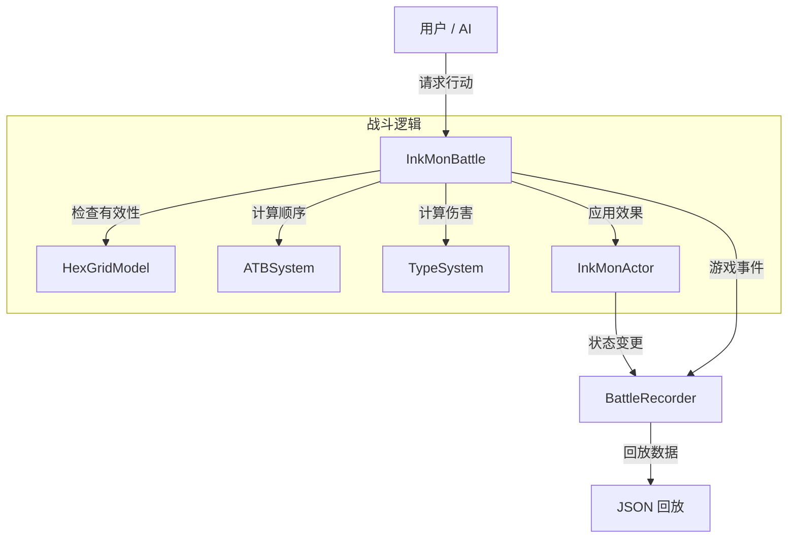
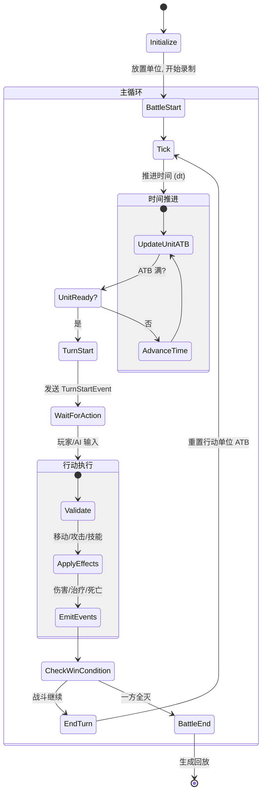

# InkMon 战斗系统概览

本文档提供了 `@inkmon/battle` 包中实现的 InkMon 战斗系统的全面概览。该系统基于 **逻辑与表现分离 (Logic-Performance Separation)** 架构设计，并完全支持 **战斗回放协议 v2 (Battle Replay Protocol v2)**。

## 1. 系统架构

该系统构建在 `@lomo/logic-game-framework` 的几个核心组件之上，并扩展了 InkMon 特有的逻辑。

### 核心组件

*   **InkMonBattle (`GameplayInstance`)**: 中央控制器。它管理战斗循环、单位状态、网格位置以及胜负条件。
*   **InkMonActor (`Actor`)**: 代表一个战斗单位。它包含属性 (Attributes)、技能 (Abilities) 以及视觉元数据（来自 `InkMon` 核心数据）。
*   **ATBSystem**: 管理 "Active Time Battle" (动态时间战斗) 逻辑，根据单位的速度决定行动顺序。
*   **BattleRecorder**: 自动将每一次状态变更（移动、伤害、Buff）记录为可序列化的 `BattleRecord`，用于回放。
*   **HexGrid**: 在六边形地图上管理空间逻辑（移动、范围检查）。

### 数据流向



## 2. 战斗循环

战斗遵循基于 Tick 的循环，时间不断推进直到某个单位的行动条 (ATB) 填满。

### 流程图



### 关键阶段

1.  **Tick 阶段**: 
    - 调用 `battle.tick(dt)`。
    - ATB 进度条根据速度增加。
    - Buff/Debuff 持续时间减少。
2.  **回合开始 (Turn Start)**:
    - 当一个单位达到 100% ATB 时，`battle.advanceToNextUnit()` 返回该单位。
    - 发送 `TurnStartEvent` 事件。
3.  **行动阶段 (Action Phase)**:
    - 外部控制器（AI 或 UI）调用 `executeMove` 或 `executeAttack` 等方法。
    - 伤害计算公式：`基础伤害 * STAB * 属性克制 * 暴击 * 随机浮动`。
4.  **回合结束 (Turn End)**:
    - 调用 `battle.endTurn()`。
    - 行动单位的 ATB 重置为 0。

## 3. 核心机制

### 伤害计算

系统采用了受宝可梦启发的伤害公式：

$$
Damage = \left( \frac{\frac{2 \times Level}{5} + 2 \times Power \times \frac{A}{D}}{50} + 2 \right) \times STAB \times Type \times Crit \times Random
$$

*   **STAB (同属性攻击加成)**: 如果招式属性与使用者属性一致，伤害 x1.5。
*   **属性克制 (Type Effectiveness)**: 源自 `TYPE_CHART`。可能是 0x (无效), 0.5x (收效甚微), 1x (正常), 或 2x (效果绝佳)。
*   **暴击 (Crit)**: 默认 6.25% 几率造成 1.5x 伤害。
*   **随机浮动 (Random)**: 0.85 到 1.00 的乘数（在确定性模式下禁用）。

### 六边形移动

*   地图坐标使用 Axial (`q`, `r`) 系统。
*   默认移动范围为 **1 格**。
*   默认攻击范围为 **1 格** (近战)，可按单位配置。

## 4. 回放系统

`BattleRecorder` 会捕获每一个相关的状态变更。

*   **属性 (Attributes)**: HP, MP 等变化会被自动追踪。
*   **事件 (Events)**: 语义化事件 (`TurnStart`, `Move`, `Attack`, `Death`) 会被推送到事件流中。
*   **输出**: `battle.getReplay()` 返回一个符合回放播放器标准的标准 JSON 对象。

## 5. 使用示例

```typescript
import { createInkMonBattle } from '@inkmon/battle';

// 1. 设置队伍
const battle = createInkMonBattle(teamAData, teamBData, {
    mapWidth: 12,
    mapHeight: 12
});

// 2. 开始
battle.start();

// 3. 循环
while (battle.isOngoing) {
    const actor = battle.advanceToNextUnit();
    if (!actor) break; // 除非战斗结束，否则不应跳出
    
    // AI 决策（简化版）
    const targets = battle.getAttackableTargets(actor);
    if (targets.length > 0) {
        battle.executeAttack(actor, targets[0], 60, 'Fire');
    } else {
        battle.executeSkip(actor);
    }
    
    battle.endTurn();
}

// 4. 获取回放
const replayData = battle.getReplay();
```
